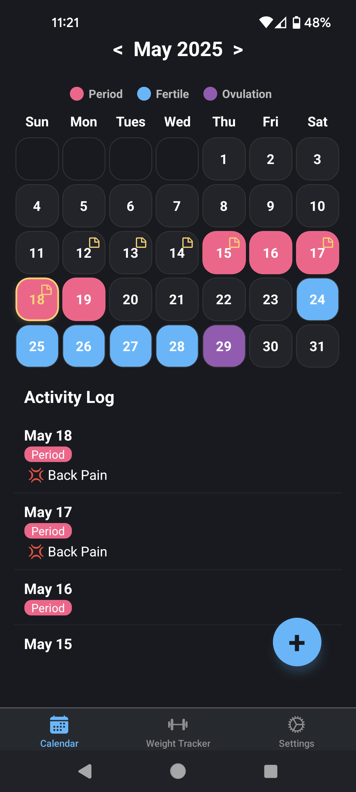
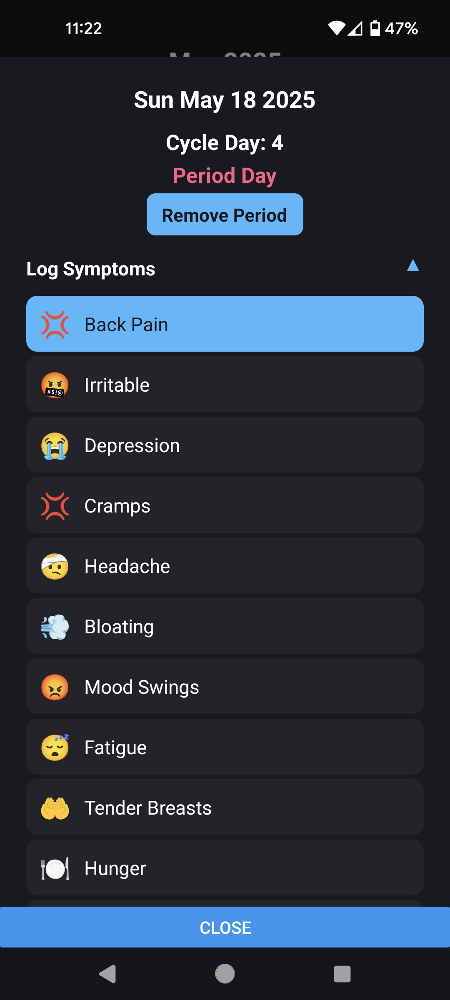
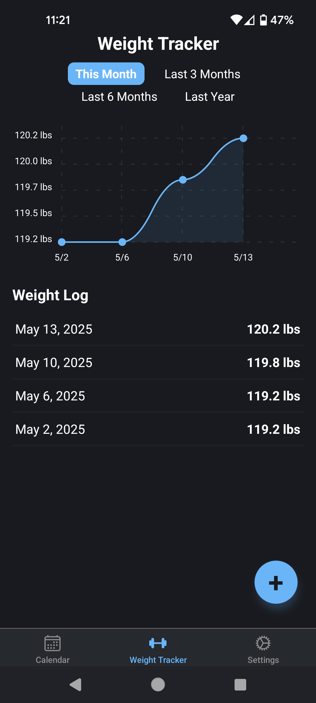
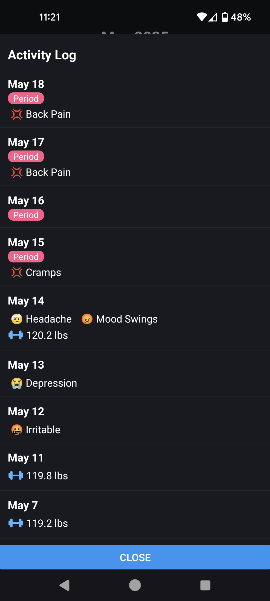
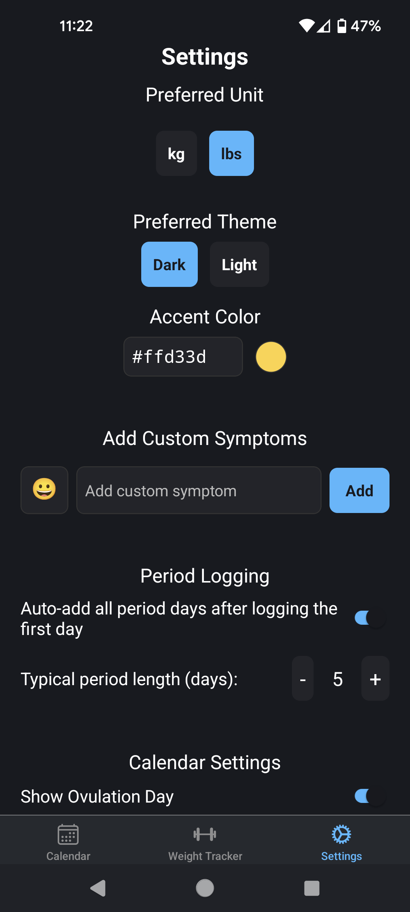

# Flow

A privacy-first period and health tracking app for mobile devices, built with React Native and Expo. It contains no ads, doesn't ask for an account, and only stores your data locally. Made with love by a female software engineer vibe-coding a period tracking app for herself. 

## Key Features

- **Period Tracking:** Log period days with one tap. First day of each period auto-fills a typical 5-day cycle (customizable).
- **Fertility & Ovulation Prediction:** See predicted fertile windows and ovulation days based on your logged cycles.
- **Symptom Logging:** Track common and custom symptoms each day. Add or remove symptoms to personalize your checklist.
- **Weight Tracking:** Log your weight daily, view trends in a chart, and switch between lbs/kg units.
- **Calendar View:** Visual month view with color-coded days for period, fertile window, ovulation, and a highlight for today.
- **Activity Log:** See a timeline of your recent period, symptoms, and weight entries.
- **Data Persistence:** All your data is stored locally on your device in a private, persistent file (no cloud or account required).
- **Privacy:** No data ever leaves your device. No ads, no tracking, no accounts.
- **Free & Open Source:** This app is free to use, open-source, and licensed under the MIT License.

## Screenshots

Below are some screenshots of Flow in action:

| Calendar View | Symptom Logging | Weight Tracker | Activity Log | Settings |
|:-----------:|:-------------:|:---------------:|:---------------:|:---------------:|
|  |  |  | | 


## License

This project is licensed under the [MIT License](LICENSE). You are free to use, modify, and distribute it.

## Development Notes

_AI USE DISCLAIMER: This app was created with the help of AI coding tools._

### For local hosting / testing:

1. Command to start the expo server: `npx expo start`. Make sure to run in this directory.
2. Open the Expo Go app on phone and scan the QR code. Make sure your PC and phone are on the same Wifi network (no ethernet).

Clean and rebuild the project:
```
npx expo prebuild
npx expo run:android
```

Tip: Sometimes, running your app in production mode locally will show errors that normally wouldn't be thrown. You can run the app locally in production by running `npx expo start --no-dev --minify`. `--no-dev` tells the server not to be run in development mode, and `--minify` is used to minify your code the same way it is for production JavaScript bundles.


### Installing the apk from Expo:
To install your React Native (Expo) app as an APK on your Android phone, follow these steps:

#### 1. Build the APK

If you are using **Expo Managed Workflow**:

1. **Install EAS CLI** (if you haven't):
   ```
   npm install -g eas-cli
   ```

2. **Login to Expo**:
   ```
   eas login
   ```

3. **Configure EAS Build** (if you haven't):
   ```
   eas build:configure
   ```

4. **Start the build for Android APK**:
   ```
   eas build --platform android --profile preview
   ```
   - For a production build, use `--profile production`.

5. Wait for the build to finish. You’ll get a link in the terminal or on the [Expo build dashboard](https://expo.dev/accounts/your-username/projects/your-project/builds).


#### 2. Download the APK

- Once the build is complete, download the `.apk` file from the Expo dashboard or the link provided in your terminal.


#### 3. Install the APK on Your Phone

1. **Transfer the APK** to your phone (via USB, email, Google Drive, etc.).
2. On your phone, **open the APK file**.
3. If prompted, allow installation from unknown sources.
4. Follow the prompts to install the app.


**Note:**  
If you are using the Bare React Native workflow, you’ll need to run `./gradlew assembleRelease` in the `android` directory and find the APK in `android/app/build/outputs/apk/release/app-release.apk`.

### Updating Dependencies

Run the following command to update dependencies to ensure compatibility with Expo:
`npx expo install --check`